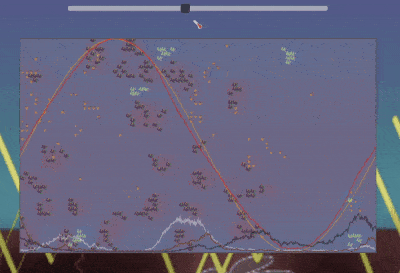
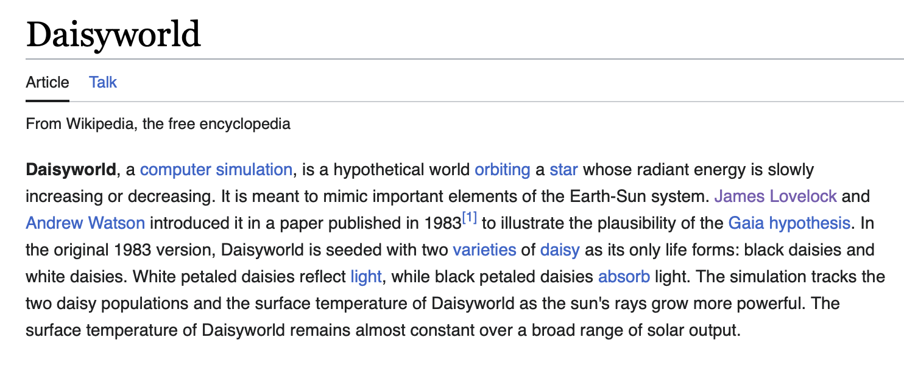

https://calculating.github.io/daisyworld/

I was a bit curious wether the Daisyworld simulation we learned about in APES be replicated as a cellular automata program. Also added some other concepts from the class for fun, like equatorial migration and predator/prey cycles.

